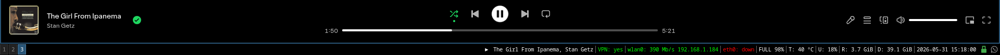
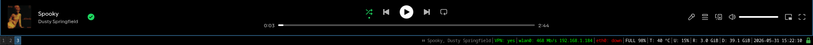

# i3-current-media
Show what is playing on your i3 status bar. 
This script uses `playerctl` and `jq`

# Screenshots



# Usage
Download `i3status_media.sh` and add it to your i3 config like so:
```
bar {
        status_command i3status | /path/to/i3status_media.sh
}
```
and make sure you added the line `output_format = "i3bar"` in your status bar config.
